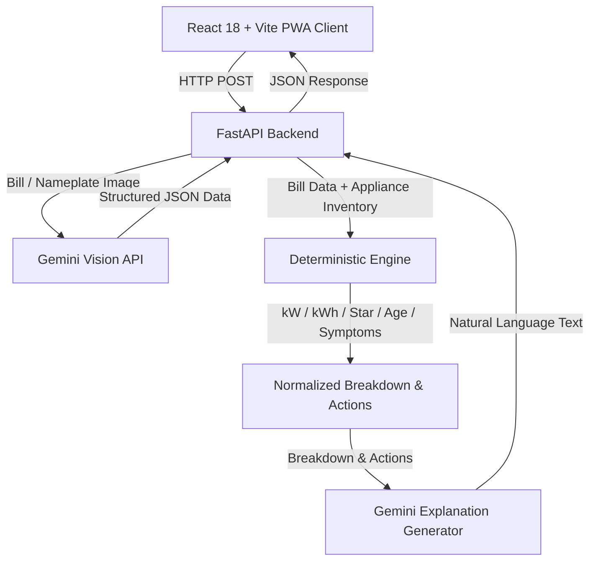

# MINCHAL ⚡

> **Turn your electricity bill into a personal household energy audit.**  
> *Build with AI: Tech for Good 2026 — GDG Coimbatore (GRD College)*

[](https://minchal-deploy.vercel.app/)
[](https://minchal-deploy.vercel.app/)
[](https://minchal-deploy.vercel.app/)
[](LICENSE)

---

## 📍 Core Architecture Story

> **"Gemini reads the bill. The deterministic engine calculates. Gemini explains."**

MINCHAL resolves a fundamental trust issue in AI applications: **LLMs should not calculate financial numbers.** MINCHAL combines multimodal Gemini vision for extraction and natural language explanation with a 100% deterministic Python calculation engine to prevent numerical hallucinations.

---

## 🌟 Live Links & Demo

- **Frontend Application**: [https://minchal-deploy.vercel.app/](https://minchal-deploy.vercel.app/)
- **Backend Health Check**: [http://127.0.0.1:8080/health](http://127.0.0.1:8080/health) (`{"ok": true, "version": "engine-1"}`)
- **90-Second Demo Guide**: [docs/DEMO.md](docs/DEMO.md)

---

## 1. The Problem

Over 300 million households across India receive monthly electricity bills with a single total rupee figure, but zero visibility into which specific appliances drive the cost. 

Traditional appliance-level energy monitoring requires expensive hardware—such as smart meters, IoT current clamps, or smart plugs. As a result, low and middle-income families cannot identify energy waste or make informed efficiency investments.

MINCHAL starts with something every household already has: **their electricity bill.**

---

## 2. The Solution

MINCHAL turns a standard electricity bill photo into an actionable, itemized energy audit in under 60 seconds:

```
 Bill Photo ──► Gemini Vision OCR ──► Appliance Inventory ──► Deterministic Engine ──► Itemized Audit & ROI Plan
```

1. **Bill Photo Extraction**: Gemini extracts consumption units, total amount, billing period, and tariff class.
2. **Appliance Profile**: User selects household inventory (AC, Refrigerator, Water Heater, Washing Machine, Fans, Pump, TV, Lights, or Custom devices).
3. **Deterministic Math Engine**: Calculates kWh consumption per appliance using wattage tables, star ratings, age factors, and efficiency symptoms.
4. **Bill Normalization**: Scales appliance estimates so their sum matches the exact total bill amount.
5. **Actionable ROI Recommendations**: Ranks habits and maintenance fixes by cost-effectiveness, optimizing action selection within user budget constraints.
6. **Bilingual Accessibility**: Full English and Tamil (தமிழ்) localized experience with working math transparency.

---

## 3. Why MINCHAL Is Different

| Feature | Hardware Smart Meters | Generic AI Chatbots | MINCHAL |
| :--- | :---: | :---: | :---: |
| **Hardware Required** | Yes (Smart plugs/meters) | No | **Zero Hardware** |
| **Upfront Cost** | ₹5,000 – ₹25,000 | Free | **₹0 (Bill-First)** |
| **Numerical Accuracy** | High | Low (LLM Hallucinations) | **100% Deterministic Engine** |
| **Appliance Attribution** | High | Low | **Scaled to Actual Bill** |
| **Bilingual Tamil Support** | Rare | Basic | **Native English & தமிழ்** |
| **Offline PWA Capability** | No | No | **Installable PWA** |

---

## 4. How AI Is Used

MINCHAL employs AI strictly where unstructured perception or natural language synthesis is required, leaving all energy mathematics to the deterministic calculation engine:

| Task | AI Technology | Why AI Is Used |
| :--- | :--- | :--- |
| **Bill Extraction** | Gemini Vision | Parses unstructured, photographed TNEB/TANGEDCO electricity bills |
| **Rating Plate OCR** | Gemini Vision | Reads optional appliance model numbers, wattage, and star ratings |
| **Audit Explanation** | Gemini 2.5/3 Flash | Synthesizes personalized, conversational audit summaries in Tamil & English |
| **Energy Calculations** | **Deterministic Python Engine** | **Prevents AI numerical hallucinations and guarantees exact financial math** |

---

## 5. System Architecture



---

## 6. Calculation Engine Methodology

MINCHAL calculates unscaled monthly consumption $E_{\text{raw}}$ for each appliance using physics-based parameters:

$$E_{\text{raw}} = \frac{P_{\text{rated}} \times \text{Hours} \times \text{DutyCycle} \times M_{\text{star}} \times M_{\text{age}} \times M_{\text{symptoms}} \times \text{BillingDays}}{1000}$$

### Normalization to Real Bill:
To guarantee that itemized breakdowns equal the exact total bill units $U_{\text{bill}}$, a scaling factor $S$ is applied:

$$S = \frac{U_{\text{bill}}}{\sum E_{\text{raw}} + E_{\text{other}}}, \quad E_{\text{final}, i} = E_{\text{raw}, i} \times S, \quad \text{Rupees}_i = E_{\text{final}, i} \times \left(\frac{\text{Bill Amount}}{U_{\text{bill}}}\right)$$

*For detailed math formulas and worked examples, see [docs/CALCULATION_ENGINE.md](docs/CALCULATION_ENGINE.md).*

---

## 7. Explainability & Data Trust

Every estimate on MINCHAL can be expanded in the UI to view the exact math steps, parameters, and confidence reasons:

- **Data Trust Badges**: Every card displays a trust indicator (`Direct Input`, `Calculated`, `Estimated Potential`).
- **Working Math Transparency**: Displays rated wattage, daily operating hours, duty cycle, star multiplier, age degradation, and normalization scaling factor.

---

## 8. Real-World Impact & SDG Alignment

MINCHAL directly contributes to the United Nations Sustainable Development Goals:

- 🟢 **SDG 7: Affordable & Clean Energy** — Reduces energy waste in households by providing actionable, low-cost efficiency habits.
- 🟢 **SDG 12: Responsible Consumption** — Empowers consumers to optimize electricity use and extend appliance lifespans.
- 🟢 **SDG 13: Climate Action** — Calculates household annual CO₂ emissions impact (0.71 kg CO₂ per kWh) and provides rooftop solar payback estimates.

---

## 9. Accessibility & Inclusivity

- **Bilingual Support**: Complete English and Tamil (தமிழ்) toggle for all UI screens, action guides, and AI explanations.
- **Mobile-First PWA**: Fully responsive layout optimized for mobile screens over cellular data networks.
- **Simple Symptom Selector**: Users select observable symptoms (e.g., *"AC cooling slowly"*, *"Fridge door seal warm"*) without requiring technical knowledge.

---

## 10. Tech Stack

- **Frontend**: React 18, TypeScript, Vite 5, Tailwind CSS, Lucide Icons, `vite-plugin-pwa`.
- **Backend**: Python 3.11+, FastAPI, Pydantic v2, Uvicorn.
- **AI Integration**: Google GenAI SDK (Gemini Vision & Gemini Flash).
- **Deployment**: Vercel (Frontend PWA), Render / FastAPI (Backend Server).

---

## 11. Project Structure

```
MINCHAL/
├── backend/
│   ├── engine/           # Deterministic calculation engine & knapsack budget planner
│   ├── gemini/           # Gemini vision OCR & explanation generators
│   ├── tests/            # Pytest suite (154 passing tests)
│   ├── main.py           # FastAPI application endpoints
│   ├── Dockerfile        # Containerized backend deployment build
│   └── requirements.txt  # Backend dependencies
├── frontend/
│   ├── src/
│   │   ├── api/          # API client & health check endpoints
│   │   ├── components/   # UI components (BillUpload, AppliancePicker, AuditResult)
│   │   ├── store/        # AuditContext & auditReducer
│   │   └── types/        # Locked API TypeScript contracts
│   ├── index.html        # Entry HTML with PWA meta tags
│   └── vite.config.ts    # Vite & Workbox PWA configuration
├── docs/                 # Architecture, API, Calculation & Security documentation
│   ├── ARCHITECTURE.md
│   ├── API.md
│   ├── CALCULATION_ENGINE.md
│   ├── SECURITY.md
│   └── DEMO.md
├── Dockerfile            # Root multi-stage Docker build
├── .dockerignore         # Docker context exclusion rules
├── .env.example          # Environment variable template
└── README.md
```

---

## 12. Local Development Setup

### 1. Clone Repository & Environment Setup
```bash
git clone https://github.com/santheesh73/Minchal-deploy.git
cd MINCHAL
cp .env.example backend/.env
```

### 2. Backend Setup
```bash
cd backend
python -m venv .venv
# On Windows: .venv\Scripts\activate | On macOS/Linux: source .venv/bin/activate
pip install -r requirements.txt
python -m uvicorn main:app --reload --port 8080
```
*Verify backend health: [http://127.0.0.1:8080/health](http://127.0.0.1:8080/health)*

### 3. Frontend Setup
```bash
cd frontend
npm install
npm run dev
```
*App served at: [http://localhost:3000](http://localhost:3000)*

---

## 13. API Endpoints

- `GET /health` — Returns system status and calculation engine version.
- `POST /api/extract-bill` — Extracts consumption units, total rupees, and tariff from bill photo.
- `POST /api/manual-bill` — Manual entry fallback endpoint when image OCR is bypassed.
- `POST /api/analyze` — Runs calculation engine, computes appliance breakdown, actions, CO2, and solar payback.
- `POST /api/plan-budget` — Solves ROI optimization for recommendations given a rupee budget.

---

## 14. Testing & Verification

- **Backend Pytest Suite**: 154 passing unit tests covering calculation logic, normalization, budget knapsack allocation, and comma OCR parsing.
  ```bash
  cd backend && python -m pytest
  ```
- **Frontend Production Build**: Zero TypeScript errors.
  ```bash
  cd frontend && npm run build
  ```

---

## 15. Limitations & Future Scope

### Technical Limitations:
- Estimates depend on user-selected daily runtime hours.
- Bill OCR accuracy depends on photo lighting and physical bill condition.
- Calculation findings represent physics-based estimations, not certified smart-meter measurements.

### Future Scope:
- Direct DISCOM portal integration for automated monthly bill sync.
- Smart plug IoT sensor Bluetooth pairing for real-time telemetry calibration.

---

## 16. Hackathon Team & Roles

- **FE-1**: Capture flow & Bill upload components
- **FE-2**: Result screen & Audit dashboard components
- **BE-1**: Gemini Vision OCR prompts & extraction schemas
- **BE-2**: Deterministic calculation engine & knapsack budget planner

---

## 17. License

Distributed under the MIT License. See [LICENSE](LICENSE) for details.
